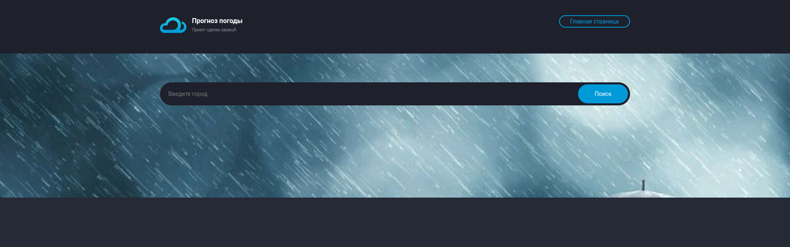
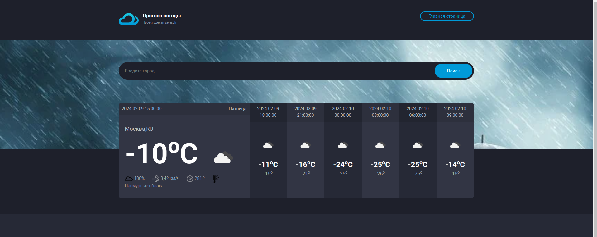

<a href="https://wakatime.com/badge/user/018c3f04-b140-41f9-a489-5b0143d153f5/project/018d8db7-7e34-4138-936f-09b8becef097"></a>

# Сайт с прогнозом погоды на день

---

## Используемые фреймворки и библиотеки

<ul>
<li><strong>Python</strong></li>
<li><strong>Django 5</strong></li>
<li><strong>Translate</strong></li>
<li><strong>HTML</strong></li>
<li><strong>CSS</strong></li>
<li><strong>Bootstrap</strong></li>
<li><strong>JavaScript</strong></li>
</ul>

---

## Установка

1. Создайте `venv` виртуальное окружение:

```bash
pip install venv virtual_env_name
```

2. Активируйте `venv` виртуальное окружение:

```bash
source virtual_env_name/Scripts/activate
```

3. Загрузите файлы с репозитория

```bash
git remote add origin https://github.com/sayasufi/weather_app.git
git pull https://github.com/sayasufi/weather_app.git master
```

4. Установите все необходимые зависимости:

```bash
pip install -r requirements.txt
```

5. Запустите сервер:

```bash
python manage.py runserver
```

---

## Скриншоты

<p align="center">
  
  
</p>

---


